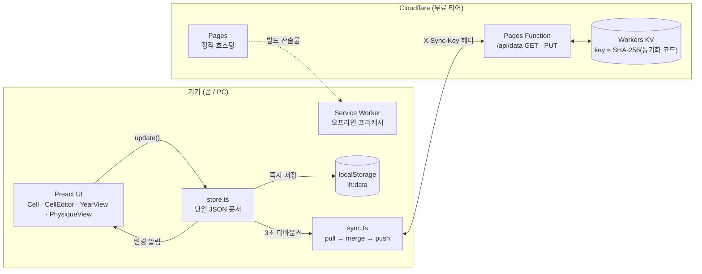

# Life Heatmap

> 종이 모눈에 손으로 칠하던 일일 루틴 기록을, **칸을 탭하는 즉시 기록되는** 개인용 웹앱으로 옮긴 프로젝트


| | |
|---|---|
| **유형** | 개인 프로젝트 · 실사용 중인 모바일 우선 PWA |
| **기간** | 2026-08-16 ~ 2026-08-24 (v1 → v2.4.1, 커밋 27개) |
| **역할** | 기획 · 요구사항 정의 · UI/UX 설계 · 프론트엔드 · 서버리스 백엔드 · 배포 · 운영 |
| **운영 비용** | **0원** (Cloudflare 무료 티어만 사용) |
| **번들** | 런타임 의존성 `preact` 1개 · 앱 JS gzip **28 KB** · 오프라인 프리캐시 전체 110 KB |

---

## 목차
1. [왜 만들었나](#1-왜-만들었나)
2. [주요 기능](#2-주요-기능)
3. [설계 원칙](#3-설계-원칙)
4. [기술 스택과 선택 이유](#4-기술-스택과-선택-이유)
5. [아키텍처](#5-아키텍처)
6. [기술적으로 공들인 부분](#6-기술적으로-공들인-부분)
7. [개발 방식: 명세 주도 개발](#7-개발-방식-명세-주도-개발)
8. [테스트와 검증](#8-테스트와-검증)
9. [프로젝트 구조](#9-프로젝트-구조)
10. [로컬 실행 · 배포](#10-로컬-실행--배포)
11. [돌아보며](#11-돌아보며)

---

## 1. 왜 만들었나

매일의 루틴(기상/출근 시각, 운동 등)을 종이 모눈에 색연필로 칠하고, 숫자나 ○/X/★ 같은 기호를 적어 기록해 왔습니다. 한눈에 흐름이 보인다는 장점은 분명했지만, 한계도 뚜렷했습니다.

- 종이는 **늘 가지고 다닐 수 없고**, 폰과 PC 어디서든 바로 기록할 수 없다.
- "며칠째 연속으로 지키고 있는지" 같은 **파생 정보는 매번 손으로 세야** 한다.
- 월별 비율, 추세 같은 **통계를 낼 수 없다**.
- 몇 달이 쌓이면 **과거 기록을 되짚어 보기 어렵다**.

시중 습관 트래커 앱은 "체크했다/안 했다"라는 이분법 위에 만들어져 있어, 빗금·단색·숫자·기호를 자유롭게 섞어 쓰던 종이 기록의 표현력을 담지 못했습니다. 그래서 **종이 모눈의 자유로움은 그대로 두고, 디지털의 이점(자동 계산·동기화·통계)만 더한** 도구를 직접 만들었습니다.

목표는 세 가지였습니다.

1. **입력 마찰 최소화** — 별도 입력 화면 없이, 히트맵의 칸을 탭하면 그 자리에서 기록 (하루 기록 3탭 이내)
2. **어디서나 같은 데이터** — 폰과 PC가 자동으로 동기화되되, 오프라인에서도 완전히 동작
3. **운영 부담 0** — 서버 관리 없음, 비용 없음, 수년간 방치해도 돌아가는 구조

---

## 2. 주요 기능

### 2.1 일반화된 히트맵 — "만들어 쓰는" 기록판

용도별 화면을 따로 만들지 않았습니다. **하나의 히트맵 컴포넌트를 사용자가 원하는 만큼 생성하고 이름을 붙여** 씁니다. 앞으로 어떤 기록이 추가될지 모른다는 전제로 설계했습니다.

| 유형 | 동작 |
|---|---|
| **일반** | 순수 수동 표기. 부가 로직 없음 |
| **연속일수형** | "실패 체크" 기준으로 연속일을 자동 계산. 길게 이어질수록 5단계로 점점 진해지는 그라데이션, 사용자 지정 마일스톤(예: 7·30·100·365일)에 glow 테두리, 현재/최고 연속일 상시 표시. **자동 채색**(매일 입력 불필요) / **수동 채색** 모드 선택 |
| **조건부형** | 칸에 수치를 입력하면 사용자가 정의한 구간 규칙(`min ≤ 값 < max` → 색·강도)으로 자동 채색. 같은 색에 강도만 달리한 규칙을 쌓으면 값에 비례하는 그라데이션이 됨. 주 평균 보기, 추세 차트 팝업 제공 |

유형은 생성 후에도 바꿀 수 있고, 바꿔도 기록은 보존됩니다.

### 2.2 칸 표기 체계

한 칸 = **채우기** + **마크** + **테두리 강조**의 자유 조합입니다.

- **채우기**: 없음 / 빗금(45° 스트라이프) / 단색 × 6색 팔레트
- **마크**: 숫자(0~99.9) *또는* 기호(○ · X · ★), 색 선택 가능
- **테두리 강조**: 채우기·마크와 독립된 토글

> 숫자와 기호가 칸 중앙이라는 한 자리를 두고 경쟁하는 문제를, "강조"를 테두리라는 별도 레이어로 분리해 해결했습니다.

**앱은 표기의 "의미"를 정하지 않습니다.** 파란 빗금이 무엇을 뜻하는지는 사용자만 압니다. 의미를 잊지 않도록 히트맵별 범례를 적어둘 수 있지만, 범례는 기본적으로 숨겨져 있어 화면을 누가 봐도 기록 내용이 드러나지 않습니다.

### 2.3 칸 탭 → 즉시 편집

- 모바일은 **바텀시트**, 데스크톱은 칸 옆 **팝오버**
- **저장 버튼 없음** — 모든 변경이 탭하는 순간 저장
- 편집기를 연 채로 다른 칸을 탭하면 대상 날짜만 바뀜 → 밀린 과거 기록을 연속으로 빠르게 입력 가능
- 미래 날짜도 입력 가능 (미리 표시해 둘 일정이 있기 때문 — 잠금 금지가 요구사항)

### 2.4 세 가지 보기

| 보기 | 내용 |
|---|---|
| **기본** | 일요일 시작 7칸 주 그리드. 최근 12주를 보여주되 **오늘 행은 화면 하단부**에 두어 지난 주들이 함께 보이게 함. 위로 스크롤하면 과거 24주씩 로드, 연도 점프 메뉴, 행 라벨 `7/5~` ↔ `W28` 토글. 모바일은 좌우 스와이프로 히트맵 전환, 데스크톱은 나란히 배치 |
| **연간** | GitHub contribution graph 스타일의 1년 한눈 보기. 가로 스크롤 없이 화면 폭에 맞춤. 「최근 1년」/연도 선택, 히트맵별 연 통계 한 줄. 칸을 탭하면 기본 보기의 그 주로 점프 |
| **신체** | 주기적인 신체 측정값(6개 지표 + 파생 비율)의 현재 상태·추세·목표 진행 대시보드. 엑셀로 관리하던 것을 이관하며 계산 방식을 개선 ([6.6](#66-신체-대시보드--결측이-있는-시계열의-회귀-예측)) |

### 2.5 그 밖의 기능

- **통계**: 카드 하단 한 줄 요약(이번 달 채움 %·기호별 횟수 / 현재·최고 연속일) + 월별·분기별 집계 오버레이. 그 히트맵에서 *실제로 사용된 표기만* 열로 구성
- **추세 팝업**(조건부형): 자동 축 스케일(nice tick), 날짜 라벨 자동 솎음, 기간 필터(전체·90일·30일), 규칙 경계값 점선, 평균·최소·최대 요약
- **기기 간 동기화**: 비밀 동기화 코드 하나로 폰·PC 연결. 계정·로그인 없음
- **JSON 백업**: 내보내기 / 가져오기(병합 또는 전체 교체)
- **PWA**: 홈 화면 설치, 완전한 오프라인 동작

---

## 3. 설계 원칙

프로젝트 시작 전에 다섯 가지 원칙을 문서로 못박고, 이후 모든 결정을 이 기준으로 판단했습니다.

1. **일반화된 히트맵** — 용도별 개별 구현 금지. 단일 컴포넌트를 사용자가 여러 개 만들어 쓴다.
2. **의미 비강제** — 색·빗금·숫자·기호의 의미를 코드나 UI 문구에 하드코딩하지 않는다. 앱은 표기 도구만 제공한다.
3. **Zero-Cost & Local-First** — 무료 티어만 사용. 입력은 항상 기기에 먼저 저장되고, 온라인일 때 백그라운드에서 동기화한다.
4. **입력 마찰 최소화** — 입력 페이지와 조회 페이지를 나누지 않는다.
5. **군더더기 없는 디자인** — 첫 화면에 히트맵이 바로 보이고, 색은 UI 크롬이 아니라 데이터에만 쓴다. 수년 사용을 전제로 레이아웃을 잡는다.

---

## 4. 기술 스택과 선택 이유

| 영역 | 선택 | 이유 |
|---|---|---|
| 빌드 | **Vite + TypeScript** | 정적 산출물, 설정 최소, 빠른 피드백 |
| UI | **Preact** (hooks) | 칸 편집·동기화 상태 등 인터랙션이 많아 컴포넌트 모델은 필요하지만, 모바일 첫 페인트를 위해 런타임은 작아야 함 (~4 KB) |
| 스타일 | **순수 CSS + CSS 변수 토큰** | 디자인 토큰(팔레트·회색 톤)을 명세와 1:1로 관리. 프레임워크 불필요 |
| 상태 | **단일 store 모듈** + localStorage | 앱 전체 상태가 JSON 문서 하나라 상태 라이브러리가 과설계 |
| PWA | **vite-plugin-pwa** (Workbox) | manifest·서비스 워커·프리캐시 자동화 |
| 백엔드 | **Cloudflare Pages Functions + Workers KV** | 엔드포인트 1개(48줄)로 충분. 서버 관리 0, 비용 0 |
| 배포 | **GitHub → Cloudflare Pages** | `main` push 시 자동 빌드·배포 |
| 테스트 | **Vitest** | 치명적인 순수 로직(날짜·연속일·병합·회귀)에 집중 |

**의존성 규칙**: 위 목록 외 라이브러리 추가를 명세로 금지했습니다. 특히 **차트·날짜 라이브러리 없이** 날짜 유틸, SVG 라인 차트, CSS 막대그래프, 심지어 PWA 아이콘 PNG 인코더까지 직접 구현했습니다. 그 결과 런타임 의존성은 `preact` 하나입니다.

---

## 5. 아키텍처



**데이터 흐름**

1. 모든 편집은 `store.update(mutator)` 한 경로를 통과합니다: *변이 → localStorage 저장 → 구독자 알림 → 동기화 예약*.
2. 동기화는 편집 3초 후(디바운스), 앱 로드 시, 탭 복귀(`visibilitychange`) 시, 네트워크 복귀(`online`) 시 실행됩니다.
3. 클라이언트가 원격 문서를 받아 **자기 쪽에서 병합**한 뒤, 결과가 원격과 다를 때만 다시 올립니다. 서버는 문서를 해석하지 않는 단순 저장소입니다.
4. 동기화 코드가 없으면 네트워크를 전혀 쓰지 않는 **로컬 전용 모드**로 완전히 동작합니다.

**데이터 모델** (요약)

```jsonc
{
  "version": 1,
  "settings":  { "weekLabel": "range", "u": 1765000000000 },
  "heatmaps": [{
    "id": "hm_a1b2c3", "name": "기상/출근", "type": "streak",
    "order": 0, "archived": false, "createdAt": "2026-07-05",
    "config": { "streak": { "mode": "auto", "baseColor": "violet", "milestones": [7, 30, 100], "levels": [1, 3, 7, 14, 30] } },
    "u": 1765000000000,                          // 메타 수정 시각
    "entries": {
      "2026-07-05": { "fill": { "style": "hatch", "color": "blue" }, "mark": { "kind": "symbol", "symbol": "star" },
                      "border": true, "u": 1765000000000 }   // 엔트리별 수정 시각
    }
  }],
  "tombstones": { "hm_x9y8z7": 1765000000000 },  // 삭제 기록 — 동기화 시 부활 방지
  "physique":   { "u": 0, "targetDate": "…", "goals": { … }, "entries": { … } }
}
```

연속일수·그라데이션 단계·마일스톤·비율·회귀선 같은 **파생 값은 하나도 저장하지 않습니다.** 저장되는 것은 사용자가 직접 입력한 사실뿐이고, 나머지는 렌더 시점에 순수 함수로 계산합니다.

---

## 6. 기술적으로 공들인 부분

### 6.1 Local-First 동기화와 LWW 병합

단일 사용자·다중 기기라는 조건에서 **CRDT는 과설계**라고 판단하고, *병합 단위를 잘게 쪼갠 Last-Write-Wins*를 택했습니다.

| 병합 단위 | 기준 |
|---|---|
| 전역 설정 | `settings.u`가 큰 쪽 |
| 히트맵 메타(이름·유형·순서·설정) | 히트맵 `id`별 `u`가 큰 쪽 |
| 칸 기록 | **(히트맵 id, 날짜)** 단위로 `u`가 큰 쪽 |
| 삭제 기록(tombstones) | 합집합 |
| 신체 측정 | 목표는 `physique.u`, 측정은 날짜별 `u` |

단위를 칸 하나까지 내렸기 때문에, 폰에서 A 칸을, PC에서 B 칸을 고쳐도 둘 다 살아남습니다. 이 방식을 안전하게 만들기 위해 해결한 문제들:

- **"지우기"도 전파되어야 한다** — 칸을 비울 때 키를 삭제하면, 병합 시 다른 기기의 옛 값이 되살아납니다. 그래서 빈 칸도 `u`만 갱신된 "지움 엔트리"로 남겨 삭제 역시 하나의 최신 쓰기로 취급합니다.
- **삭제한 히트맵의 부활 방지** — 히트맵 삭제 시 `tombstones[id] = 삭제시각`을 남기고, 병합 때 **메타와 모든 엔트리 중 가장 최근 수정 시각**보다 tombstone이 늦으면 삭제를 유지합니다. 반대로 삭제 이후 다른 기기에서 수정이 있었다면 부활로 간주하고 tombstone을 정리합니다.
- **동기화 루프 방지** — 병합 결과를 로컬에 반영할 때는 동기화 훅을 호출하지 않는 별도 경로(`replaceData`)를 사용하고, 병합 결과가 원격과 **다를 때만** PUT 합니다.
- **동시 실행 제어** — 동기화 중 새 요청이 오면 플래그만 세워두고, 끝난 뒤 한 번 더 예약합니다.
- **백업 가져오기 재사용** — JSON 백업의 "병합 가져오기"도 같은 `mergeData`를 씁니다. 동기화와 백업이 하나의 검증된 병합 로직을 공유합니다.

### 6.2 계정 없는 동기화 — 비밀 코드 = 키

로그인 시스템 없이 "이 기기들만 같은 데이터를 본다"를 구현했습니다.

- 앱이 `crypto.getRandomValues`로 24자 동기화 코드를 생성 → 다른 기기에 같은 코드 입력
- 클라이언트가 **`SHA-256(코드)`의 hex**를 KV 키로 사용 → 서버는 코드 원문을 절대 받지도 저장하지도 않음
- Pages Function은 키 형식(64자 hex) 검증, JSON 유효성 검증, 5 MB 상한(413)만 수행 — 48줄, 외부 의존성 없음
- 배포 URL을 아는 사람이 접속해도 **빈 앱**만 보입니다. 데이터는 각 기기의 localStorage와, 코드를 아는 사람만 계산할 수 있는 KV 키 아래에만 존재합니다.

### 6.3 렌더링 규칙을 순수 함수 하나로

칸 하나의 최종 모습은 기록 원본, 히트맵 유형, 연속일수 단계, 마일스톤, 조건부 규칙, 오늘/과거/미래 상태가 얽혀 결정됩니다. 이를 컴포넌트에 흩어두지 않고 **`cellVisual(heatmap, date, today)` 순수 함수**로 모았습니다.

- 우선순위 규칙이 한 곳에 명시됨: 실패 체크는 채우기만 배타(마크·테두리는 유지), 수동 채움도 연속일 단계 강도를 따름, 조건부 수치 표시 중엔 마크 비활성 등
- **기본 보기와 연간 보기가 같은 함수를 공유**하고, 연간 보기는 결과를 compact 모드로 축소 렌더만 합니다 → 두 보기의 표기가 어긋날 수 없음
- 조건부형 "주 평균 보기"도 이 결과 위에 토요일 칸의 표시 숫자만 덮어쓰는 방식이라, 원본 데이터와 편집 동작은 전혀 건드리지 않습니다

### 6.4 날짜 라이브러리 없이, 타임존 버그 없이

- 모든 날짜를 **로컬 타임존 `YYYY-MM-DD` 문자열**로 다룹니다. `new Date('2026-07-05')`가 UTC 자정으로 해석되어 한국 시간에서 날짜가 밀리는 고전적 버그를 피하기 위해, 문자열을 직접 쪼개 로컬 자정 `Date`로 만드는 `parseDate`만 사용합니다.
- 날짜 차이는 밀리초 차를 **반올림**해 DST 전환 시 23/25시간 오차를 흡수합니다.
- 주 번호는 "1월 1일이 포함된 일요일 시작 주 = W1, 주의 소속 연도는 그 주 토요일의 연도"로 정의하고, 기존 종이 기록의 주 번호와 일치하는지 확인한 뒤 **연 경계 케이스를 테스트**로 고정했습니다.

### 6.5 실기기에서만 드러난 iOS Safari 레이아웃 버그

연간 보기(7행 × 53열 그리드)를 배포한 뒤 실제 iPhone에서 두 차례 버그 제보가 있었습니다.

| 차수 | 증상 | 원인 | 해결 |
|---|---|---|---|
| 1차 (v1.4.1) | 그리드 열이 붕괴 | `1fr` 트랙이 `min-content`로 계산되며 숫자 텍스트가 칸을 밀어냄 | `minmax(0, 1fr)` 트랙, 월 라벨 `width: 0`으로 트랙 영향 제거 |
| 2차 (v1.4.3) | 행 높이가 눌림 | `aspect-ratio`로 만든 정사각 칸이 Safari에서 행 높이를 제대로 확정하지 못함 | **CSS 계산을 포기하고 JS로 확정**: `ResizeObserver`로 컨테이너 폭을 측정해 `칸 px = floor((폭 − 라벨열 − 간격×열수) / 열수)`를 계산, 열·행 트랙 모두 px로 명시 |

2차 수정 때는 "소형 칸에서 빗금은 판독 불가, 숫자는 넘친다"는 점도 함께 정리해, 연간 보기에서는 채우기를 단색으로 통일하고 숫자 표기를 제거했습니다(기호는 SVG라 유지). 재발을 막기 위해 **"`1fr` + `aspect-ratio` 조합 금지"와 그 이력을 명세에 기록**해 두었습니다.

### 6.6 신체 대시보드 — 결측이 있는 시계열의 회귀 예측

엑셀로 관리하던 신체 측정표를 세 번째 뷰로 이관하면서, 단순 이관이 아니라 **엑셀 계산의 결함을 함께 고쳤습니다.**

- **부분 입력 허용** — 매번 모든 지표를 재지 않으므로, 각 지표를 *독립 시계열*로 다룹니다. 시작값·현재값·진행률·추세가 지표마다 다른 날짜를 기준으로 계산됩니다.
- **파생 비율의 정합성** — 어깨/허리 비율은 "각자의 최신값 조합"이 아니라 **두 값이 같은 날 함께 측정된 기록에서만** 점을 만듭니다. 서로 다른 날의 값을 섞으면 존재한 적 없는 비율이 나오기 때문입니다.
- **예측 방식 개선** — 엑셀의 "최근 4주 창" 방식은 주 1회 측정에서 노이즈가 커서, **전 기간 최소제곱 선형 회귀**로 교체했습니다. 회귀선이 목표값에 닿는 날을 예상 달성일로 산출하고, 점 2개 미만 / 기울기 0 / 목표 반대 방향이면 "데이터 부족"·"현재 추세로 도달 불가"로 구분해 표시합니다.
- **종합 진행률 버그 수정** — 엑셀에서 평균에 비율 지표가 빠져 있던 실수를 바로잡고, 진행률은 `clamp(0, 1)`로 오버슈트를 막았습니다.
- **데이터 오염 방지** — 엑셀에서 미래 날짜에 적어둔 임시값이 "최신값"으로 잡히던 문제를 막기 위해 미래 날짜 입력을 금지했습니다.
- 추세 차트는 서로 단위가 다른 지표를 한 화면에 겹치기 위해 **시작값=위, 목표값=아래로 정규화한 축**을 쓰는 자체 SVG 차트이며, 마지막 점에서 목표일까지 회귀 연장선을 점선으로 그립니다.

### 6.7 모바일 인터랙션 디테일

- **초기 스크롤 위치**: 오늘 행을 화면 최상단이 아니라 하단부에 둡니다. 기록 앱에서 사용자가 보고 싶은 건 "오늘"만이 아니라 "오늘까지의 흐름"이기 때문입니다.
- **과거 로드 시 스크롤 점프 방지**: 위쪽에 행을 prepend하기 전 `scrollHeight`를 기억해 두고, `useLayoutEffect`에서 늘어난 높이만큼 `scrollTop`을 보정해 화면이 튀지 않습니다.
- **스와이프 전환은 JS 없이** CSS `scroll-snap`으로 구현 → 세로 스크롤과의 제스처 충돌이 원천적으로 없음. 데스크톱에서는 스냅을 끄고 그리드로 나란히 배치.
- **연속 입력을 막던 버그**: E2E 검증 중, 편집기 뒤의 반투명 backdrop이 다른 칸 클릭을 가로채 "편집기를 연 채 다른 칸 탭"이 동작하지 않는 문제를 발견 → backdrop을 제거하고 외부 클릭 감지 방식으로 교체.
- **소수 입력 시 커서 점프**: controlled input에 파싱된 숫자를 되돌려 넣다 보니 `7.`을 치는 순간 점이 지워지고 커서가 튀던 문제 → 입력 중인 문자열은 컴포넌트 로컬 상태로 유지하고 store에는 파싱값만 반영. 같은 문제가 있던 설정 화면의 숫자 입력들은 공용 `NumInput` 컴포넌트로 통일.

### 6.8 의존성 0의 작은 도구들

- **SVG 차트**: 추세 팝업의 축 범위는 데이터 min/max에 여백을 두고 1·2·2.5·5 × 10ⁿ 단위의 *nice step*으로 확장, 날짜 라벨은 4~5개로 자동 솎음, 점이 40개를 넘으면 점 마커를 숨깁니다.
- **통계 막대**: 차트 라이브러리 대신 `div` 폭으로 그리는 CSS 막대.
- **PWA 아이콘 생성기**: 이미지 도구 없이 `node:zlib`만으로 PNG 청크(IHDR/IDAT/IEND)와 CRC32를 직접 인코딩해, 앱 팔레트로 칠한 3×3 미니 히트맵 아이콘을 생성합니다 (`scripts/gen-icons.mjs`).

---

## 7. 개발 방식: 명세 주도 개발

이 저장소에서 코드만큼 중요한 자산은 `specs/` 디렉터리입니다.

```
specs/
├── 00_overview.md            개요 · 5대 원칙 · 용어
├── 01_requirements.md        요구사항 R-01 ~ R-32  +  결정 로그 D-1 ~ D-25
├── 02_data_model.md          스키마 · 파생값 계산 규칙 · 동기화 프로토콜 · 병합 규칙
├── 03_ui_spec.md             화면 구조 · 칸 레이어 순서 · 상태별 렌더링 · 디자인 토큰
├── 04_architecture.md        스택 · 디렉터리 구조 · 배포 체크리스트 · 테스트 기준
└── 05_physique_dashboard.md  신체 대시보드 지표 · 스키마 · 계산 규칙
```

**운영 규칙**

1. **명세가 유일한 진실(SSOT)** — 구현이 명세와 달라져야 할 사정이 생기면, 코드보다 **명세를 먼저 고치고** 그 이유를 결정 로그에 남깁니다.
2. **결정에는 근거를 남긴다** — 25개의 결정(D-#) 각각에 "무엇을, 왜, 누구의 요청으로" 바꿨는지 기록했습니다. 예를 들어 순서 변경을 드래그 대신 위/아래 버튼으로 바꾼 이유(D-9: 모바일 터치 드래그가 스크롤 제스처와 충돌), iOS 레이아웃 방식 변경의 이력(D-14, D-16) 등이 모두 추적됩니다.
3. **작업 단위마다 Roadmap 갱신** — `Roadmap.md`의 체크리스트와 변경 로그를 매 작업 종료 시 업데이트합니다.
4. **커밋 메시지에 요구사항·결정 번호 연결** — 예: `조건부형 주 평균 보기 + 추세 팝업 (R-32, D-24, D-25)`

**AI 코딩 에이전트와의 협업**

구현은 AI 코딩 에이전트(Claude Code)와 함께 진행했습니다. 이때 위의 명세 체계가 결정적인 역할을 했습니다.

- 요구사항 정의·UX 판단·우선순위 결정은 제가 하고, 확정된 내용을 명세로 문서화한 뒤 에이전트에게 **명세만 읽고 구현·검증까지 끝낼 수 있는 작업 지시서**(`GOAL.md`)와 작업 지침(`CLAUDE.md`)을 제공했습니다.
- "의미를 코드에 하드코딩하지 않는다", "허용 목록 외 의존성 금지" 같은 **제약을 명문화**해 구현이 원칙에서 벗어나지 않게 했습니다.
- 대화가 끊겨도 명세·결정 로그·Roadmap만 읽으면 누구든(사람이든 에이전트든) 맥락을 복원할 수 있는 구조가 되었습니다.

**타임라인**

| 날짜 | 버전 | 내용 |
|---|---|---|
| 08-16 | 명세 v1 확정 → **v1** | 스캐폴드 → 그리드·편집기 → 설정 → 통계·백업 → 동기화 → PWA·E2E를 6단계로 나눠 **당일 구현·배포** |
| 08-16 | v1.1 ~ v1.2 | 실사용 피드백: 실패 체크와 마크 동시 표기, 자동 채색 양식 선택 |
| 08-17 | v1.3 ~ v1.4.3 | 연간 보기 추가, UI 톤을 웜 그레이 → 쿨 그레이로 전환, iPhone 실기기 버그 2건 수정 |
| 08-18 | v1.4.4 | 연도가 누적돼도 UI가 늘어나지 않도록 연도 선택을 드롭다운으로 |
| 08-20 | **v2** · v2.1 | 신체 대시보드 명세 확정(목업 승인) → 구현 |
| 08-24 | v2.2 ~ v2.4.1 | 소수 입력, 조건부 규칙 강도, 주 평균 보기, 추세 팝업 |

---

## 8. 테스트와 검증

### 유닛 테스트 — Vitest, 4개 파일 · 34개 테스트

"틀리면 조용히 데이터가 망가지는" 순수 로직에 테스트를 집중했습니다. UI는 E2E와 수동 확인으로 대체했습니다.

| 파일 | 검증 대상 |
|---|---|
| `dates.test.ts` | 일요일 시작 주, 종이 기록과의 주 번호 일치, **연 경계**의 주 번호, 행 라벨·분기 키 |
| `streak.test.ts` | 실패 체크와 **미입력이 섞인** 연속일 계산, 시작일 규칙, 그라데이션 단계, 마일스톤 판정 |
| `merge.test.ts` | 엔트리 단위 LWW, 양방향 수정 충돌, **tombstone 삭제 유지/부활**, 입력 불변성, 구버전 백업 호환, 신체 데이터 병합 |
| `physique.test.ts` | 부분 입력 시계열, **비율 동일-엔트리 규칙**, 진행률 클램프, 회귀·예상 달성일, 도달 불가 판정, 필요 페이스 |

```bash
$ npm test
 ✓ src/lib/dates.test.ts    (6 tests)
 ✓ src/lib/streak.test.ts   (8 tests)
 ✓ src/lib/merge.test.ts    (9 tests)
 ✓ src/lib/physique.test.ts (11 tests)
 Tests  34 passed (34)
```

### E2E 검증 — 헤드리스 Chrome

마일스톤마다 실제 사용자 흐름을 브라우저로 끝까지 돌렸습니다.

- **v1**: 히트맵 3개(유형별) 생성 → 유형별 칸 입력 → 새로고침 후 유지 → 백업 다운로드 → KV push 확인 → **두 번째 브라우저 컨텍스트에서 pull 수신** → 375 px / 1280 px 스크린샷
- **연간 보기**: 1년치 시드 데이터로 모바일·데스크톱 레이아웃 확인
- **v2**: 빈 상태 → 시드 → 부분 입력 저장 → 수정/삭제 → 차트 탭 전환 → 목표 설정 → 새로고침 유지 → 데스크톱

### 실사용 피드백 루프

배포 후 실제로 매일 쓰면서 나온 불편(바텀시트가 아래쪽 칸을 가림, 아이콘만으로는 보기 전환이 직관적이지 않음, 연도 버튼이 계속 늘어남 등)을 결정 로그에 기록하고 바로 반영했습니다. v1.1부터 v2.4.1까지의 개선 버전 대부분이 이 루프에서 나왔습니다.

---

## 9. 프로젝트 구조

```
life_heatmap/
├── CLAUDE.md                  작업 지침 (고정 규칙 · 문서 안내)
├── GOAL.md                    v1 구현 작업 지시서
├── Roadmap.md                 진행 상황 · 변경 로그
├── specs/                     명세 SSOT (00 ~ 05)
└── web_app/
    ├── functions/api/data.ts  Pages Function — GET/PUT /api/data (KV 바인딩 LH_KV)
    ├── scripts/gen-icons.mjs  무의존성 PWA 아이콘 PNG 생성기
    ├── public/                아이콘
    ├── vite.config.ts         Preact · PWA(manifest, Workbox) · Vitest 설정
    └── src/
        ├── app.tsx            앱 셸 — 헤더, 보기 전환(기본|연간|신체), 스와이프 보드
        ├── components/
        │   ├── HeatmapCard · CellGrid · Cell      기본 보기
        │   ├── CellEditor                         칸 편집기 (바텀시트/팝오버)
        │   ├── YearView · YearJump                연간 보기 · 연도 점프
        │   ├── StatsView · CondTrendPopup         통계 · 추세 차트
        │   ├── PhysiqueView · PhysiqueEntryModal  신체 대시보드
        │   ├── SettingsView · CreateFlow          설정 · 히트맵 생성
        │   └── LegendPopover · SyncUI             범례 · 동기화 표시/설정
        ├── lib/
        │   ├── types.ts       스키마 타입 · 기본값
        │   ├── store.ts       단일 store · localStorage 영속화 · 마이그레이션
        │   ├── render.ts      cellVisual — 칸 시각 상태 순수 함수
        │   ├── dates.ts       로컬 날짜 · 주 번호 유틸
        │   ├── streak.ts      연속일 · 단계 · 마일스톤
        │   ├── stats.ts       월/분기 집계
        │   ├── physique.ts    시계열 · 회귀 · 예측
        │   ├── merge.ts       LWW 병합 (동기화 · 백업 공용)
        │   ├── sync.ts        동기화 엔진
        │   └── backup.ts      JSON 내보내기/가져오기
        └── styles/            tokens.css (디자인 토큰) · app.css
```

TypeScript·CSS·테스트를 합쳐 약 4,400줄입니다.

---

## 10. 로컬 실행 · 배포

### 로컬 실행

```bash
cd web_app
npm install
npm run dev        # 개발 서버 (동기화 없이 로컬 전용 모드로 모든 기능 동작)
npm test           # 유닛 테스트
npm run build      # 타입 체크 + 프로덕션 빌드 → dist/
```

동기화 API까지 로컬에서 확인하려면 Wrangler로 Pages Functions와 로컬 KV를 함께 띄웁니다.

```bash
npm run build
npx wrangler pages dev dist --kv LH_KV
```

### 배포 (Cloudflare Pages, 최초 1회)

1. GitHub 저장소를 Cloudflare Pages에 연결 — Root `web_app` / Build `npm run build` / Output `dist`
2. Workers KV 네임스페이스 생성
3. Pages 프로젝트 → Settings → Functions → KV namespace bindings: 변수명 **`LH_KV`** ↔ 생성한 네임스페이스
4. 재배포 후 앱 설정에서 동기화 코드 생성 → 다른 기기에서 같은 코드 입력

이후에는 `main`에 push하면 자동으로 빌드·배포됩니다.

---

## 11. 돌아보며

- **작게 쪼갠 LWW는 개인용 동기화에 충분히 강력했습니다.** 병합 단위를 "문서"가 아니라 "칸 하나"로 내리고, 삭제도 쓰기로 취급하는 두 가지 결정만으로 CRDT 없이 다중 기기 충돌을 실용적으로 해결할 수 있었습니다.
- **저장하지 않는 것이 가장 안전한 캐시였습니다.** 연속일수·단계·비율·예측을 전부 파생 계산으로 둔 덕분에, 규칙이 바뀌어도(D-11, D-23 등) 데이터 마이그레이션 없이 과거 기록 전체에 즉시 반영되었습니다.
- **모바일 레이아웃은 실기기가 최종 테스트입니다.** 데스크톱 브라우저와 헤드리스 검증을 통과한 그리드가 iOS Safari에서만 무너졌고, 결국 CSS 트릭 대신 측정값으로 크기를 확정하는 쪽이 가장 견고했습니다.
- **명세와 결정 로그는 협업 비용을 낮춥니다.** 요구사항이 바뀔 때마다 "왜"를 남겨두니 이전 결정을 다시 논쟁하지 않게 되었고, AI 에이전트와 작업할 때도 맥락 전달이 문서 하나로 끝났습니다.

**백로그**: 다크 모드 · 숫자와 기호의 동시 표시(모서리 배지) · 동기화 코드 기반 클라이언트 측 E2E 암호화 · CSV 내보내기 · 신체 지표 사용자 정의
